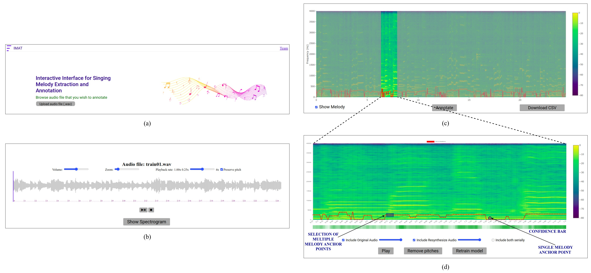

# Summary
Estimating singing melody from polyphonic audio is a fundamental task in the field of music information retrieval. There are many downstream applications of melody estimation, including music recommendation[(`@mr`)](https://ieeexplore.ieee.org/document/9414458), cover song identification[(`@cvi`)](https://ieeexplore.ieee.org/document/9747630), music generation[(`@mg`)](https://archives.ismir.net/ismir2020/paper/000146.pdf), and voice separation[(`@vs`)](https://ieeexplore.ieee.org/document/7178034). To achieve high performance in the downstream applications, the estimated melody should be highly accurate. There are both signal processing[(`@sp1`)](https://repositori-api.upf.edu/api/core/bitstreams/1864c4d1-2c39-4474-9578-4da95d30f391/content)[(`@sp2`)](https://ieeexplore.ieee.org/document/5431024), and machine learning-based[(`@ml1`)](https://archives.ismir.net/ismir2018/paper/000286.pdf)[(`@ml2`)](https://brianmcfee.net/papers/ismir2017_salience.pdf) algorithms for estimating the melody from the polyphonic audios. The drawback of these methods is that the estimated melody may be inaccurate. The inaccuracies can be caused by the presence of loud accompaniments, inherent noise in the audio, or model inaccuracies. The user must correct the inaccurately estimated melody to make it suitable for downstream applications. One way of correcting the melody is by manual annotation, which is time-consuming and labor-intensive, creating a need for more efficient approaches.

In this work, we have developed IMAT, an interactive tool that uses our previously proposed model-agnostic machine-learning-based algorithm, i.e., active-meta-learning[(`@aml`)](https://ieeexplore.ieee.org/abstract/document/10530096) that combines active-learning[(`@al`)](https://dl.acm.org/doi/pdf/10.1145/3472291) and meta-learning[(`@maml`)](https://proceedings.mlr.press/v70/finn17a/finn17a.pdf) to efficiently annotate the singing melody. When audio is given as an input to IMAT, the corresponding spectrogram is calculated, and the algorithm uses active learning to identify the low-confidence time frames. These frames are available for the user to correct by manual annotation, which can be aided by visual and auditory feedback. The algorithm then adapts to these corrections using meta-learning, thus providing a more precise melody annotation of the entire audio. This process, referred to as adaptive annotation, allows users to perform melody annotation by significantly reducing manual effort compared to traditional approaches. It also enables researchers working on interactive learning for melody estimation to develop and test new algorithms within a flexible framework.


# Statement of Need
Existing annotation tools fall into two main categories: 
- For monophonic audios (like [Tony](https://www.sonicvisualiser.org/tony/))
- For polyphonic audios (like [Sonic Visualizer](https://www.sonicvisualiser.org/) with MELODIA[`(melodia)`](https://ieeexplore.ieee.org/document/6155601))

A point to note is that both tools use signal processing algorithms for estimating melody. However, these tools have significant limitations:

1. Both tools require extensive manual annotation, which is time-consuming and labor-intensive.
2. They lack uncertainty estimation capabilities to identify regions most likely needing correction and, hence, do not adapt to user corrections.
3. Both tools exhibit strong coupling between their interfaces and underlying algorithms, lacking the modular architecture necessary to integrate alternative approaches without extensive code modifications. 

IMAT addresses these limitations by:

1. **Adaptive Annotation:** The tool learns from user corrections using meta-learning, improving overall accuracy by reducing manual effort.
2. **Uncertainty Estimation:** Active-learning identifies low-confidence frames requiring user attention, optimzing the annotation workflow.
3. **Model-agnostic Approach:** IMAT implements a flexible, model-agnostic framework compatible with any machine learning model that treats melody estimations as a multi-class classification problem with uncertainty estimation capabilities. This plugin architecture seemleassly integrate custom models without modifying the underlying codebase. 


# Software Description
## Architecture Overview
IMAT is developed using the Python FLASK framework for the back-end with the front-end components built using JavaScript, HTML, and CSS. The tool can operate efficiently on a CPU and does not necessitate the use of a GPU. It provides a user-friendly interface for loading audio file, visualizing the spectrogram, and perform adaptive annotation. The tool consists of the following main components: 

1. Pre-processing Module: Converts the uploaded audio files (.wav) into spectrogram (of shape $F\times T$, $F$ are the number of frequnecy bins and $T$ are the number of time frames) and extracts initial melody estimates with the uncertainty estimates using the *pluggable* machine learning model.
2. Annotation Module: Identifies low-confidence frames that require user annotation and adapts the melody estimation model based on user corrections.

## Pre-processing Module
The uploaded audio is converted to a spectrogram which serves as input to our model archiecture. The base model $f_{[\theta,\phi]}$ consists of two components: feature extraction layers parameterized by $\theta$ and classification layer parameterized by $\phi$. 

Additionally, a confidence model $f_{\psi}$ is built on top of the feature extraction layers of the base model. This confidence estimation is crucial for the active learning component, allowing the system to identify which predictions require user verification. 

## Annotation Module
After obtaining the melody estimates and confidence values, the system highlights low-confidence time frames in the visualization interface. Users can focus on these highlighted sections and make corrections through an intuitive interface. Using meta-learning, the system then adapts both the base model $f_{[\theta,\phi]}$ and confidence model $f_{\psi}$ based on these corrections, immediately updating melody estimates and confidence values across the entire spectrogram. This approach only requires correcting a small subset of frames, as the system generalizes these corrections to similar contexts throughout the audio, optimizing both annotation accuracy and efficiency.


The workflow of the tool is depicted in Figure 1. 

{width=100% fig.align="center"}
Figure 1. IMAT Interface: (a) user uploads any .wav audio file, (b) user visualizes the uploaded audio waveform, (c) user visualizes the corresponding spectrogram overlayed with estimated melody and zooms into a particular time range, (d) user corrects the incorrect melody anchor points corresponding to low confidence frames by manual annotation (in that time range).

The installation and usage instructions are detailed in README.md file of the [project repository](https://github.com/madhavlab/imat_taslp)

<!-- - Detailed installation and usage instructions
- Details of how different ML models can be integrated with IMAT. -->

## How to integrate different ML models?
IMAT natively uses two separate models - one for melody estimation and another for confidence. Researchers may use either of the following approaches:

1. Separate Models Approach - Same architecture but with different melody estimation and confidence models. 
2. Single Model Approach - A single model that predicts both melody estimates and corresponding confidence. 

The researchers need to follow the following steps to integrate the models:

1. **When using separate models** - To integrate your custom melody and confidence estimation models:<br>
   Replace the melody and confidence models in the **utils.py** file with your custom models as shown. 

   ```
   class melody_extraction(Model):
    """CNN model for melody extraction."""
    def __init__(self):
        super().__init__()
        <---initialize layers>

    def call(self, x):
        <---model layers--->
        int_output = second_last_layer_model(x)
        x = last_layer_of_model(int_output)
        return x, int_output

    def build_graph(self, raw_shape):
        x = Input(shape=raw_shape)
        return Model(inputs=[x], outputs=self.call(x))

   class ConfidenceModel(Model):
      """Model for confidence estimation."""
      def __init__(self, pretrain_model=None):
        self.pretrain = pretrain_model
        <---initialize layers of confidence model--->

      def call(self, x):
        _,x = self.pretrain(x) # get intermediate features from the melody estimation model
        <---model layers--->
        x = last_layer_of_confidence_model(x)
        return x

      def build_graph(self, raw_shape):
          x = Input(shape=raw_shape)
          return Model(inputs=[x], outputs=self.call(x))

   ```  
**Important notes:**
- The melody estimation model must return both predictions and intermediate features.
- The confidence model should take the melody model as input and use its features to predict the confidence values.
- Both models must maintain the expected input/output shapes for compatibility with IMAT's processing pipeline.
- The pretrained weights of melody estimation model and confidence model should be present in the directory ```/models/pre/``` and ```/models/conf/``` respectively.

2. **When using a single model** - To integrate a single model that predicts both melody and confidence:<br>
Need to make changes in the **utils.py**, **melody_processing.py**, and **app.py**    

In *utils.py*, replace both the melody_extraction and ConfidenceModel with a single model as shown

```
# Add your single model to utils.py

class SingleMelodyConfidenceModel(Model):
    def __init__(self):
        super().__init__()
        # Initialize your model layers
        # ...
        
    def call(self, x):
        # Your model implementation
        # ...
        
        # IMPORTANT: Must return these three outputs
        return melody_predictions, confidence_values
        
    def build_graph(self, raw_shape):
        x = Input(shape=raw_shape)
        return Model(inputs=[x], outputs=self.call(x))
```

In *app.py*, replace model initialization as shown

```
# Single Model Initialization

model = ut.SingleMelodyConfidenceModel()
model.build_graph([500, 513, 1])
model.load_weights('./models/single_model/weights')
```

In *melody_processing.py*, modify the processing functions as

```
# Modify these functions in melody_processing.py

def get_melody_json(model, X):
    """Extract melody from spectrogram using unified model."""
    X = np.expand_dims(X, axis=0)
    X = (X - mean) / std
    X = X[:, :, :, np.newaxis]
    
    # Get predictions from single model
    pred, _ = model(X)  # melody, confidence
    pred = pred.numpy()
    
    # Process predictions to get frequencies
    pred_freq = []
    for i in range(pred.shape[1]):
        idx = np.argmax(pred[0, i, :])
        freq = pitch_range[idx]
        pred_freq.append(freq)
    
    t = np.arange(0, len(pred_freq) * 0.01, 0.01)
    return {"t": t.tolist(), "f": pred_freq}

def conf_values(model, X):
    """Get confidence values from unified model."""
    X = np.expand_dims(X, axis=0)
    X = (X - mean) / std
    X = X[:, :, :, np.newaxis]
    
    # Get prediction with confidence values
    _, conf = model(X)
    return conf
```

**Important notes:**

- The single model must return both melody predictions and corresponding confidence.
- The single model must maintain the expected input/output shapes for compatibility with IMAT's processing pipeline.
- The pre-trained weights of the model should be present in the directory ```/models/single_model/```.

# Acknowledgements

We acknowledge contributions from Saransh Shivhare during the development of this tool. This work is supported by Prasar Bharti, India's public broadcasting agency. 

# References
